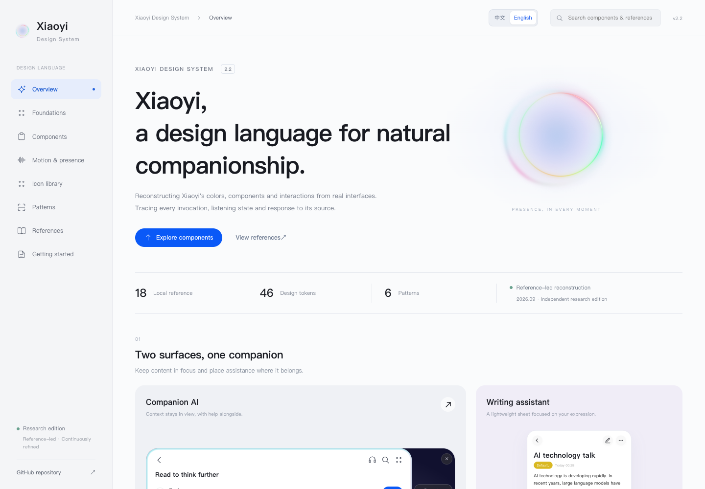
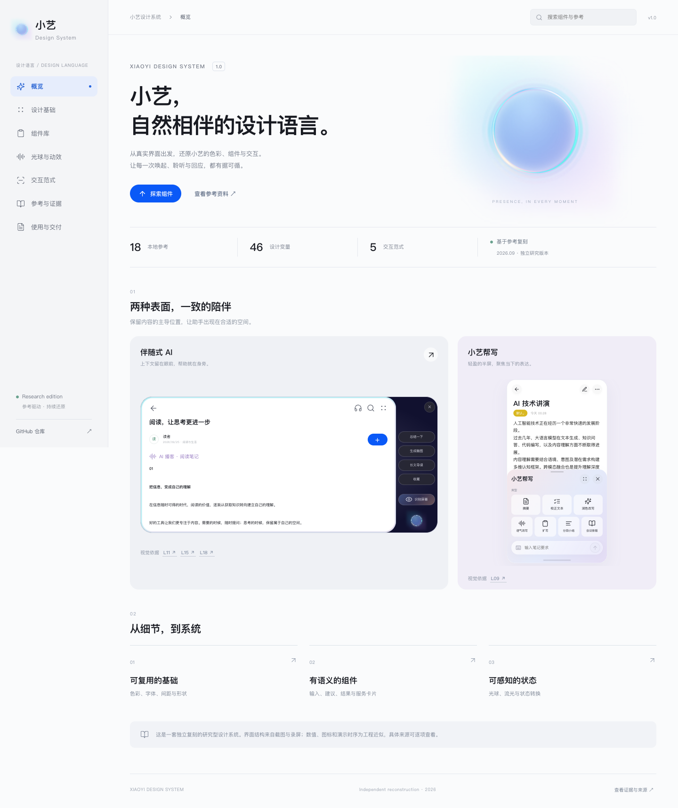

# Xiaoyi Design System · 小艺设计系统

[English](#english) · [中文](#中文)

## English

An evidence-led reconstruction of Xiaoyi for design research, interaction review and prototyping. It includes a documentation website, React components, CSS variables, editable JSON tokens, Three.js TSL motion, 77 SVG icons and six complete interaction examples.

This is an independent research project, **not Huawei's official design system**. Observed structure, estimated values and inferred semantics are distinguished. AI, voice, camera, visual search and cross-app actions are local simulations, without real Xiaoyi services.

Use **中文 / English** in the header. The choice is remembered locally; `?lang=en` and `?lang=zh` also select a language. All Markdown files contain both languages. Original Chinese reference figures remain unchanged and have English explanations. Reference, web-source, token, icon and motion-stage JSON files include explicit English metadata while original filenames, source URLs and hashes remain intact.



### Start here by role

Designers: open the [English website](http://127.0.0.1:5197/?lang=en) for interactive specimens, then use the [design specification](docs/design-spec.md#english), [component states](docs/components.md#english), [motion measurements](docs/motion.md#english), [companion edge-light measurements](docs/edge-light.md#english), and [evidence table](docs/evidence.md#english). Every reference has a stable L or W ID; observed evidence and reconstruction estimates are labeled separately.

Developers: begin with the [React component API](docs/components.md#english) and [common controls](docs/controls.md#english), then use the [icon library](docs/icons.md#english), [motion API](docs/motion.md#english), and [edge-light reuse guide](docs/edge-light.md#english). The JSON sources in `tokens/` and `reference/` expose `*En` metadata alongside their Chinese fields. The manifest, web-source and token copies under `public/downloads/` mirror their source JSON; motion-stage metadata stays in `reference/motion-analysis.json`. Keep source IDs, URLs, original filenames and SHA-256 values unchanged when integrating the assets.

### Run and verify

Requires Node.js 20.19+ or 22.12+.

```sh
npm ci
npm run dev
npm run build
npm run check
npm test
```

Open [the local site](http://127.0.0.1:5197/?lang=en). Port 5197 is fixed to prevent accidentally opening another project. The build regenerates tokens and downloads, then produces a static site. Checks validate references, hashes and download parity. Browser tests use installed Chrome; alternatively install Playwright Chromium and remove `channel: 'chrome'` from `playwright.config.js`.

Original media is not uploaded. A clone runs independently; integrity checks explicitly report whether local originals were available.

### Contents

| Area            | Coverage                                                                                                                                                                                                 |
| --------------- | -------------------------------------------------------------------------------------------------------------------------------------------------------------------------------------------------------- |
| Foundations     | 46 tokens: 14 colors, 11 spacing values, 6 radii, 7 type sizes, 6 durations, 2 curves                                                                                                                    |
| Components      | Orb, buttons, icon buttons, chips, input, messages, service cards, writing sheet, companion sidebar, selection results and navigation bar                                                                |
| Common controls | 9 reusable exports: Card, Slider, ActionChip, BottomChips, Toast, Switch, Checkbox, RadioGroup, Progress; 6 interactive groups                                                                           |
| Motion          | Three.js TSL / WebGPU with WebGL2 fallback; transparent composition; 23.217 s timeline, 28 annotated parameters and 38 samples                                                                           |
| Companion edge  | Reusable transparent TSL overlay; 15 measured width profiles, 13 color samples, six controls and reuse documentation                                                                                     |
| Icons           | 77 SVGs, React component, symbol sprite, provenance manifest and ZIP; searchable with size, stroke and color controls                                                                                    |
| Patterns        | Companion reading, contextual writing, full-screen conversation, circle to ask, drag to Xiaoyi and Look at the World                                                                                     |
| References      | 18 local files (13 images, 5 videos, one duplicate image); 43 catalog previews, 38 motion samples, one local comparison proxy; 18 web sources, 3 OpenHarmony figures and 5 attributed vision derivatives |
| Documentation   | Design specification, component API, evidence, reconstruction limits and verification                                                                                                                    |

### Files and reuse

- `src/components.jsx`: component and demo exports; `src/controls/`: common controls.
- `src/motion/`: TSL graph, renderer lifecycle, timeline and parameters; `src/icons/`: SVG geometry and library.
- `src/vision/`: simulated Look at the World and official comparison figures.
- `src/i18n/`: English catalog, persistent language context and JSX presentation boundary. State, URLs, source filenames and user input are not translated.
- `src/main.jsx`: eight documentation pages, navigation, search and reference dialog; `src/styles.css`: shared styles.
- `tokens/xiaoyi.tokens.json`: editable token source using this project's `$type` / `$value` schema, without claiming latest DTCG validation. `src/tokens.css` is generated; do not edit it directly.
- `reference/manifest.json`: source paths, hashes, sizes, durations and observations; `web-sources.json`: official documentation and video leads; `light-field-fit.json`: 38 fitted samples.
- `public/reference/`: traced derivatives; `docs/`: documentation and preview; `scripts/`: generation and checks; ignored `qa/`: local test artifacts.

Originals stay unchanged in `../小艺/`. Regenerate previews with `npm run inventory` (Python Pillow and FFmpeg; the script defaults to macOS Arial Unicode), then `npm run build`. Observations are retained by hash. `seed-data.py` is a one-time initialization script, not a routine update command.

```jsx
import { Orb, Chip, AssistantInput } from './src/components.jsx';
import './src/tokens.css';
import './src/styles.css';

<Orb state="listening" size={96} />
<Chip onClick={() => summarize()}>Summarize</Chip>
<AssistantInput onSubmit={(text) => submit(text)} />
```

These sources can be moved into a React prototype. Isolate global `body` / `button` styles when embedding in an existing product. No npm package has been published. To retain automatic localization, also copy `src/i18n/`, wrap the app in `LanguageProvider`, and configure Vite's JSX import source as shown in this repository.

### Evidence, scope and rights

See [companion edge light and reuse](docs/edge-light.md#english), [controls](docs/controls.md#english), [motion](docs/motion.md#english), [icons](docs/icons.md#english), [design specification](docs/design-spec.md#english), [evidence](docs/evidence.md#english), [verification](docs/verification.md#english) and [attribution](docs/attribution.md#english).

The [GitHub repository](https://github.com/purryc/xiaoyi-design-system) is an existing public source and documentation repository, not a public deployment. Xiaoyi, HarmonyOS and reference media belong to their rights holders. Icons are self-drawn reference reconstructions or style extensions. HarmonyOS Sans is not distributed; installed fonts or system fallbacks are used.

Every live orb uses real Three.js TSL with transparent borders; the source recording plays only as a separate comparison video. The complete stage sequence is implemented, but fast intersecting rings, trails and highlights still differ visibly. Passing functional tests does not establish pixel identity.

---

## 中文

基于真实截图和录屏复刻的小艺设计系统，用于设计研究、交互审阅和原型开发。包含可浏览的文档站点、React 组件、CSS 变量、可编辑 JSON Tokens 、Three.js TSL 动效、77 枚 SVG 图标和 6 个完整交互样例。

这是独立研究复刻，**不是华为官方设计系统**。结构依据参考还原；数值和动效语义的推断均有标注。AI、麦克风、摄像头、识图、跨应用操作为本地模拟，不调用真实小艺服务。



界面右上角可切换中文 / English，语言选择保存在本机；也可使用 `?lang=en` 或 `?lang=zh`。所有 Markdown 都含完整中英文说明。参考清单、网络来源、设计变量、图标和动效阶段 JSON 同时提供英文字段；原始文件名与参考图中的中文保持原样，并附英文解读。

## 开始使用

需要 Node.js 20.19+ 或 22.12+。

```sh
npm ci
npm run dev
```

打开 [本地设计系统](http://127.0.0.1:5197)。端口固定为 5197，避免悄悄打开另一个项目。

```sh
npm run build    # 重新生成 tokens.css 与下载资源，构建静态站点
npm run check    # 清单、来源、原始媒体哈希、Tokens 与下载资源一致性
npm test         # Chrome 中检查页面、交互、下载与减少动态效果
```

浏览器测试默认使用本机 Chrome。如未安装 Chrome，可安装 Playwright Chromium 并从 `playwright.config.js` 中移除 `channel: 'chrome'`。原始参考不随仓库上传，克隆后仍能独立运行站点与浏览器测试；`check` 会明确报告是否验证到本地原始媒体。

## 内容

| 内容       | 范围                                                                                                                                                       |
| ---------- | ---------------------------------------------------------------------------------------------------------------------------------------------------------- |
| 设计基础   | 46 个变量：14 色、11 间距、6 圆角、7 字号、6 时长、2 曲线                                                                                                  |
| 组件       | 光球、按钮、图标按钮、建议胶囊、输入条、消息、服务卡片、帮写面板、伴随侧栏、圈选结果、导航条                                                               |
| 常用控件   | 信息/操作卡片、Slider、底部 Chip、Toast、Switch、Checkbox、RadioGroup、Progress；状态与来源逐项标注                                                        |
| 动效       | Three.js TSL / WebGPU；23.217 s 原片时间轴、28 个注释参数、38 个采样时点；WebGL2 兼容                                                                      |
| 伴随边缘光 | 独立透明 TSL 叠加层；15 条原图宽度剖面、13 组动态配色、6 个可调参数与复用说明                                                                              |
| 图标       | 77 枚自绘 SVG、React 组件、symbol sprite、来源清单、ZIP；搜索及笔画/尺寸/色彩调节                                                                          |
| 交互范式   | 伴随阅读、上下文帮写、全屏对话、圈选问答、拖给小艺、小艺看世界                                                                                             |
| 参考       | 18 个本地文件（13 图、5 视频；其中两图是同一内容），43 张目录预览 + 38 张动效采样图 + 1 个本地对照代理视频，18 条网络资料（含 8 条控件补充及看世界官方图） |
| 文档       | 设计规格、组件 API、状态与来源、还原边界、验证报告                                                                                                         |

## 目录

- `src/components.jsx`：独立导出的 React 组件与演示组合。
- `src/i18n/`：语言切换、838 条英文翻译与 JSX 展示边界。
- `src/vision/`：看世界状态示例及官方参考。
- `src/controls/`：9 个可复用常用控件与 6 组可操作示例。
- `src/motion/`：TSL 节点图、渲染生命周期、时间轴、参数面板。
- `src/icons/`：SVG 几何源、React 图标、图标库。
- `reference/light-field-fit.json`：38 个时点的高斯光场和傅里叶轮廓拟合系数。
- `src/main.jsx`：8 个页面与文档导航、全局搜索、参考对话框。
- `src/styles.css`：组件及文档样式，使用 `.xy-` 前缀区分基础组件。
- `tokens/xiaoyi.tokens.json`：可编辑变量源。采用带 `$type` / `$value` 的本项目格式，未承诺通过最新 DTCG 验证。
- `src/tokens.css`：由源 Tokens 生成；不要手动修改。
- `reference/manifest.json`：文件来源、哈希、分辨率、时长、采样时间与观察记录。
- `reference/web-sources.json`：官方说明和视频平台线索。
- `public/reference/`：原图缩略图及录屏采样帧，保留来源关系。
- `docs/`：交付文档与站点预览。
- `scripts/`：生成、完整性检查与浏览器测试。
- `qa/`：本地测试记录和截图，不提交。

完整原始参考保留在相邻 `../小艺/` 中，未更名、移动、改写或复制原始媒体。要重新生成预览，运行 `npm run inventory`（需要 Python Pillow 与 FFmpeg；脚本默认使用 macOS Arial Unicode 字体），然后 `npm run build`。观察文字会按哈希保留。`seed-data.py` 是首次建库的初始化脚本，不应作为日常更新命令。

## 复用

```jsx
import { Orb, Chip, AssistantInput } from './src/components.jsx';
import './src/tokens.css';
import './src/styles.css';

<Orb state="listening" size={96} />
<Chip onClick={() => summarize()}>总结一下</Chip>
<AssistantInput onSubmit={(text) => submit(text)} />
```

这份组件源码适合直接移入 React 原型。当前样式含文档站点的全局排版规则，嵌入既有产品时需先隔离全局 `body` / `button` 等选择器；本次没有发布 npm 包。详见 [组件 API](docs/components.md)。

## 证据与版本

- [常用控件与 Reference](docs/controls.md)：卡片、Slider、Chip、Toast 和选择/进度控件的用法与边界。
- [伴随态边缘光与复用](docs/edge-light.md)：测量宽度、TSL 透明叠加层、6 个参数与 React 用法。
- [动效模型与全部参数](docs/motion.md)：TSL 构造、可调参数、内部系数、时间轴、误差。
- [图标库](docs/icons.md)：覆盖范围、SVG / React 用法与来源。
- [设计规格](docs/design-spec.md)：视觉基础、布局比例、状态模型、行为与边界。
- [完整证据表](docs/evidence.md)：每个本地来源和网站的覆盖范围。
- [验证报告](docs/verification.md)：实际执行的检查、浏览器与局限。
- [GitHub 仓库](https://github.com/purryc/xiaoyi-design-system)：源码与文档备份（现有仓库为公开）；没有部署公网服务。

小艺 / HarmonyOS 品牌、截图及视频素材的权利归各自权利人。图标已全部改为本项目自绘矢量，区分参考重绘与同风格扩展。HarmonyOS Sans 不随项目分发，优先读取本机字体，否则回退系统中文字体。见 [归属说明](docs/attribution.md)。

## 动效验证范围

整站光球均由真实 Three.js TSL 绘制，没有视频贴图或 CSS 环形替代。原片仅在对照页以独立 video 播放。已复刻完整阶段序列；高速交错环的姿态、拖影、高光扩散仍有可见偏差，不能称作逐像素完全一致。2.2 统一透明背景，支持中文 / English 切换；文档与 GitHub 介绍提供两种语言。
